# Storybook Meta Preview

An experimental platform for exploring "Storybookification" — extending Storybook beyond UI components into a universal composition engine with pluggable preview renderers.

The core concept: a standalone HTML page (the **meta-preview**) that connects to Storybook via WebSocket and live-renders whatever story is selected in Storybook's manager. Selecting a story in Storybook updates the meta-preview in real time, on any device on the same network.

See `storybookification_summary_v2.md` for the full concept.

---

## Demo

**[YouTube playlist — all integrations](https://www.youtube.com/playlist?list=PLaKfCBPwsq-P_mKld6xILdG8falcFrF7d)**

---

## Built with

- [Storybook](https://storybook.js.org) — component story framework; provides the manager UI, controls, and preview iframe
- [Three.js](https://threejs.org) — 3D/2D geometry and rendering for the `threejs-2d`, `threejs-3d`, and `openbrush` setups
- [Tone.js](https://tonejs.github.io) — Web Audio synthesis and sequencing for the `audio` setup
- [Tonal.js](https://github.com/tonaljs/tonal) — music theory utilities (notes, chords, scales, progressions) used in `audio` stories
- [Open Brush](https://openbrush.app) — VR painting application; the `openbrush` setup drives it via its HTTP API
- [BanterVR](https://bantervr.com) — social VR platform; the `bantervr-ui` setup builds and previews UI panels, and the `bantervr-3d` setup builds and previews 3D objects for Banter worlds ([SDK docs](https://bantervr.com/documentation))
- [ROT.js](https://ondras.github.io/rot.js/hp/) — roguelike toolkit; used in the `tui` setup for dungeon map generation (`Map.Digger`) and the `ROT.Display` canvas renderer in Storybook preview
- [xterm.js](https://xtermjs.org) — browser terminal emulator; used in the `tui` meta-preview to render ANSI escape sequences from the story grid

---

## How it works

```
Storybook manager → story selected → preview iframe renders it
→ storybook-channel decorator captures HTML
→ sends to relay server via WebSocket
→ relay broadcasts to all connected meta-preview clients
→ meta-preview.html updates its DOM
```

---

## Setups

Each setup is an independent experiment with its own Storybook config, story files, and ports. Multiple setups can run simultaneously.

### html

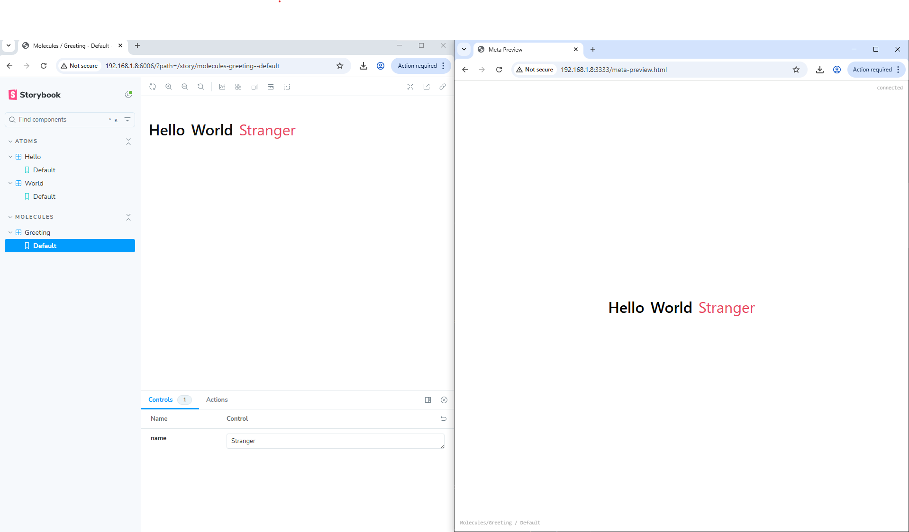

The baseline setup. Uses `@storybook/html-webpack5` — stories render plain HTML strings.

| | |
|---|---|
| Storybook | `http://[host]:6006` |
| Meta Preview | `http://[host]:3333/meta-preview.html` |

**Run:**
```bash
yarn dev:html
```

**Stories:**
- `Atoms / Hello` — renders `<span class="atom">Hello</span>`
- `Atoms / World` — renders `<span class="atom">World</span>`
- `Molecules / Greeting` — composes Hello + World with a live `name` arg control

### threejs-2d

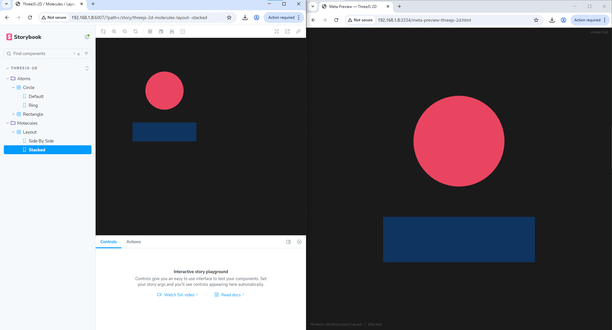

Orthographic Three.js scenes. Reference example for the "ThreeJS 2D layout approach". Stories build flat geometry scenes using `PlaneGeometry`, `CircleGeometry` etc. with `MeshBasicMaterial` (no lighting needed). The meta-preview owns a Three.js renderer and rebuilds the scene via `ObjectLoader` on every story change.

| | |
|---|---|
| Storybook | `http://[host]:6007` |
| Meta Preview | `http://[host]:3334/meta-preview-threejs-2d.html` |

**Run:**
```bash
yarn dev:threejs-2d
```

**Stories:**
- `ThreeJS-2D / Atoms / Rectangle` — filled and outlined variants
- `ThreeJS-2D / Atoms / Circle` — filled and ring variants
- `ThreeJS-2D / Molecules / Layout` — side-by-side and stacked compositions

### threejs-3d

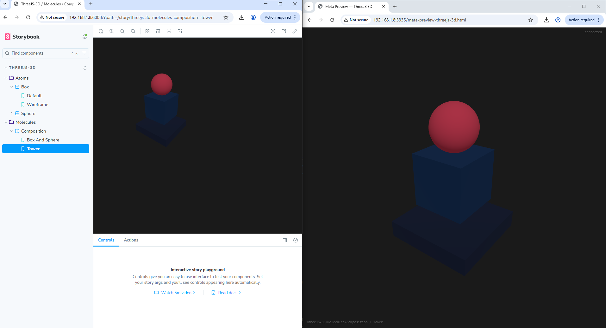

Perspective Three.js scenes. Reference example for the "ThreeJS 3D component approach". Stories build 3D geometry scenes using `BoxGeometry`, `SphereGeometry` etc. with `MeshStandardMaterial` and default lighting. The meta-preview owns a Three.js perspective renderer with `OrbitControls` and rebuilds the scene via `ObjectLoader` on every story change.

| | |
|---|---|
| Storybook | `http://[host]:6008` |
| Meta Preview | `http://[host]:3335/meta-preview-threejs-3d.html` |

**Run:**
```bash
yarn dev:threejs-3d
```

**Stories:**
- `ThreeJS-3D / Atoms / Box` — solid and wireframe variants
- `ThreeJS-3D / Atoms / Sphere` — default and shiny (metalness/roughness) variants
- `ThreeJS-3D / Molecules / Composition` — box + sphere side-by-side, and a stacked tower

### audio

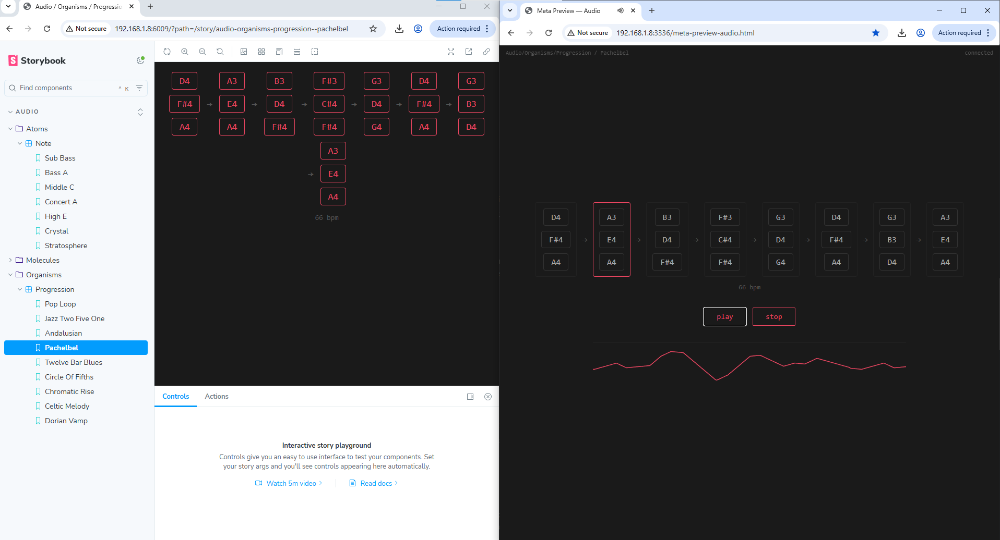

Structured music data stories. Stories return plain data objects (notes, chords, progressions) — the meta-preview owns the Tone.js engine entirely. Selecting a story updates the meta-preview display; press Play to hear it.

| | |
|---|---|
| Storybook | `http://[host]:6009` |
| Meta Preview | `http://[host]:3336/meta-preview-audio.html` |

**Run:**
```bash
yarn dev:audio
```

**Stories:**
- `Audio / Atoms / Note` — 7 single notes from sub-bass (A1) to stratosphere (C8)
- `Audio / Molecules / Chord` — 14 chords: triads, sevenths, extended, quartal, cluster, power chord
- `Audio / Organisms / Progression` — 9 progressions: Pop Loop, Jazz ii–V–I, Andalusian, Pachelbel, 12-bar Blues, Circle of Fifths, Chromatic Rise, Celtic Melody, Dorian Vamp

### openbrush

**Mandala**
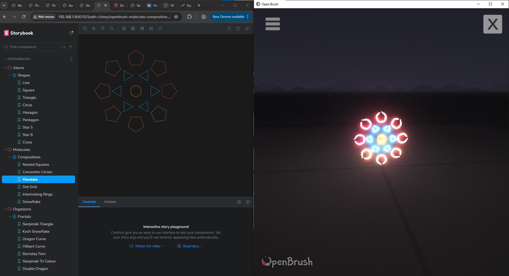

**Concentric Circles**


**Sierpinski Triangle**


**Sierpinski Tri Colour**


**Koch Snowflake**


**Dragon Curve**


**Double Dragon**


**Hilbert Curve**


**Barnsley Fern**


**Village**
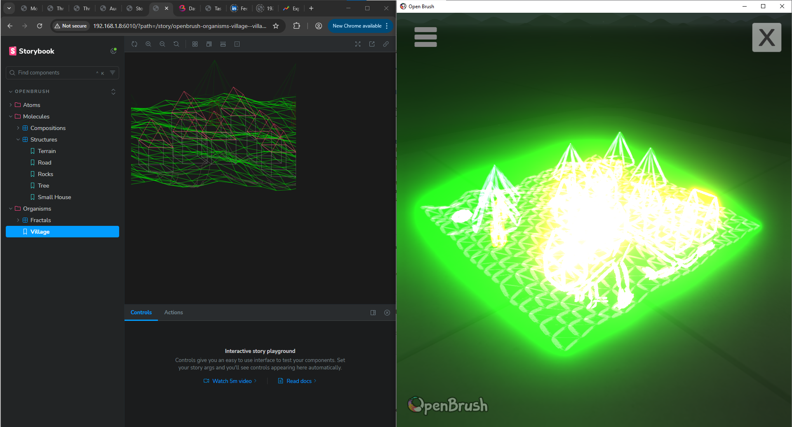

Open Brush API command stories. Stories generate sequences of brush commands; the Storybook preview renders a 2D canvas preview with oblique projection so 3D strokes have visible depth. The meta-preview auto-sends commands to a running Open Brush instance via its HTTP API whenever a story is selected.

Three.js is used as a pure geometry calculator — `EdgesGeometry` extracts wireframe edges from any `BufferGeometry`, which are then converted to `draw.path` commands. No Three.js renderer is used.

Requires Open Brush running with `--EnableApiRemoteCalls --EnableApiCorsHeaders`.

| | |
|---|---|
| Storybook | `http://[host]:6010` |
| Meta Preview | `http://[host]:3337/meta-preview-openbrush.html` |

**Run:**
```bash
yarn dev:openbrush
```

**Meta-preview controls:**
- **send to open brush** — re-sends the current story manually
- **save** — saves the current sketch to a new slot (`save.new`)
- **export** — exports the sketch to Open Brush's Exports folder (`export.current`)
- **show exports** — opens the Exports folder on the desktop (`showfolder.exports`)

**Stories:**
- `OpenBrush / Atoms / Shapes` — Line, Square, Triangle, Circle, Hexagon, Pentagon, Star5, Star8, Cross (all with interactive controls)
- `OpenBrush / Atoms / Volumes` — 12 Three.js geometry primitives: Cube, Sphere, Cylinder, Cone, Torus, TorusKnot, Icosahedron, Octahedron, Tetrahedron, Dodecahedron, Capsule, TriangularPrism
- `OpenBrush / Molecules / Compositions` — NestedSquares, ConcentricCircles, Mandala, DotGrid, InterlockingRings, Snowflake
- `OpenBrush / Molecules / Structures` — Terrain (Perlin fBm), Road (organic branching, terrain-conforming, independent road/terrain seeds), Tree, Rocks, SmallHouse
- `OpenBrush / Organisms / Fractals` — SierpinskiTriangle, KochSnowflake, DragonCurve, HilbertCurve, BarnsleyFern, SierpinskiTriColour, DoubleDragon
- `OpenBrush / Organisms / Village` — full scene: terrain + road network + proximity-placed houses, trees, and rocks

### bantervr-ui

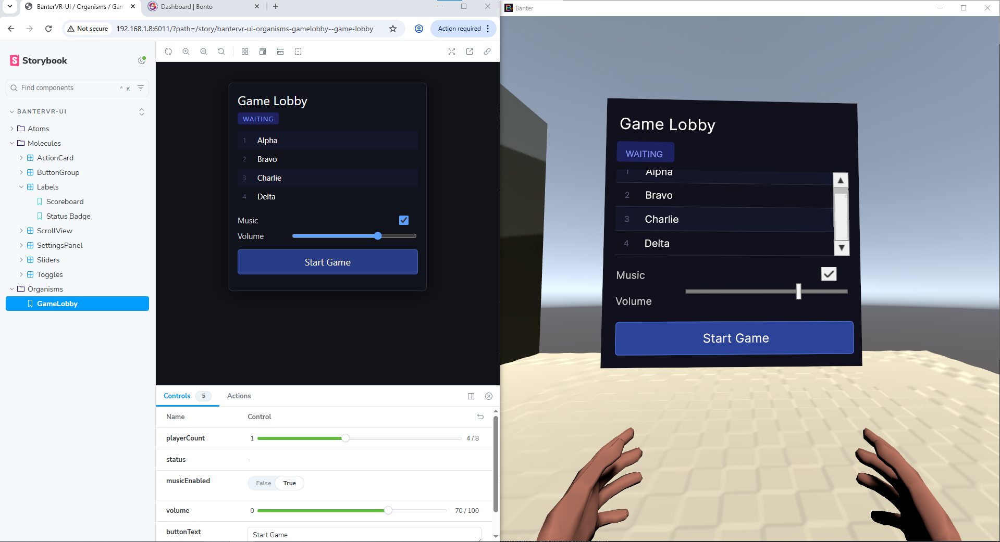

BanterVR UI Toolkit stories. Stories build UI panels using the Banter SDK element types (`UILabel`, `UIButton`, `UISlider`, `UIToggle`, `UIScrollView`, `UIVisualElement`). The Storybook preview renders an approximate HTML version; the inject script reconstructs the real panel in-world via WebSocket.

| | |
|---|---|
| Storybook | `http://[host]:6011` |
| Meta Preview | `http://[host]:3338/meta-preview-bantervr-ui.html` |

**Run:**
```bash
yarn dev:bantervr-ui
```

**In-world setup:**

Add the inject script to your Banter world's `index.html`. It connects to the relay automatically and rebuilds the active story in-world whenever a story is selected:

```html
<script position="0 1.5 2" rotation="0 180 0" scale="1 1 1"
        src="http://[host]:3338/meta-preview-bantervr-inject.js"></script>
```

To verify the panel pipeline is working independently of Storybook, load the standalone demo:

```html
<script src="http://[host]:3338/bantervr-ui-test.js"></script>
```

The demo script (`public/bantervr-ui-test.js`) also serves as a reference for all known-good Banter UI patterns — individual padding properties, transparent UILabel background, slider/toggle initialisation sequence, button sizing — with inline comments explaining each rule.

**Stories:**
- `BanterVR-UI / Atoms / Buttons` — Button (all properties), ConfirmCancel, IconButton
- `BanterVR-UI / Atoms / Labels` — Label (all properties)
- `BanterVR-UI / Atoms / Inputs` — Slider, Toggle
- `BanterVR-UI / Atoms / VisualElement` — VisualElement (all properties), FlexRow, FlexColumn, FlexWrap, Nested
- `BanterVR-UI / Molecules / ActionCard` — title + description + button
- `BanterVR-UI / Molecules / ButtonGroup` — IconButton (emoji icon), ImageIconButton (known limitation — see below), ConfirmCancel
- `BanterVR-UI / Molecules / Labels` — Scoreboard, StatusBadge
- `BanterVR-UI / Molecules / Sliders` — SliderLabelled, SliderWithRange
- `BanterVR-UI / Molecules / Toggles` — ToggleLabelled, ToggleGroup
- `BanterVR-UI / Molecules / ScrollView` — VerticalList, HorizontalList, MixedContent
- `BanterVR-UI / Molecules / SettingsPanel` — volume slider, brightness slider, music toggle, SFX toggle
- `BanterVR-UI / Organisms / GameLobby` — full panel: status badge, player scroll list, music toggle, volume slider, action button

**Known limitations:**
- `backgroundImage` on `UIVisualElement` does not render in BanterVR — Unity UI Toolkit requires a `Sprite`/`Texture2D` asset reference and does not support runtime URLs. Emoji characters are the recommended approach for inline icons.

### bantervr-3d

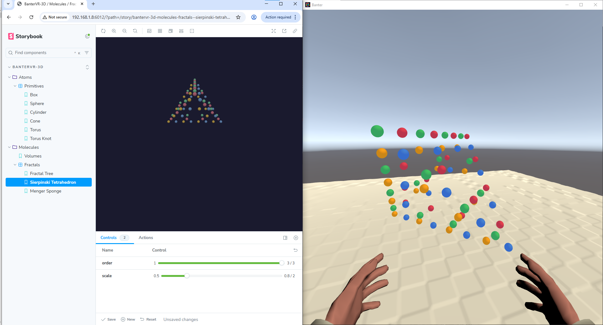

BanterVR 3D object stories. Stories build 3D scenes using Banter SDK geometry components (`BanterBox`, `BanterSphere`, `BanterCylinder`, `BanterCone`, `BanterTorus`, `BanterTorusKnot`) and `BanterMaterial`. A lightweight Three.js mock renders an approximate preview in Storybook; the inject script reconstructs the full scene graph in-world using the native BS API via WebSocket.

Branch positions and orientations for complex structures are computed in world space and applied directly to individual objects — no cascading rotation through pivot parents, so the scene graph round-trips cleanly through JSON serialisation.

| | |
|---|---|
| Storybook | `http://[host]:6012` |
| Relay | `http://[host]:3339` |
| Inject / demo (HTTPS) | `https://[host]:33390` |

**Run:**
```bash
yarn dev:bantervr-3d
```

**In-world setup:**

Add the inject script to your Banter world's `index.html`. Position, rotation and scale of the root container are read from the tag attributes:

```html
<script position="0 1.5 2" rotation="0 0 0" scale="1 1 1"
        src="https://[host]:33390/meta-preview-bantervr-inject-3d.js"></script>
```

To verify the 3D pipeline independently of Storybook, load the standalone demo:

```html
<script src="https://[host]:33390/bantervr-3d-test.js"></script>
```

The demo script (`public/bantervr-3d-test.js`) is also a reference for all known-good Banter 3D patterns — component order, material application, parent/child hierarchy, physics, and lights — with inline comments explaining each rule.

**Stories:**
- `BanterVR-3D / Atoms / Primitives` — Box, Sphere, Cylinder, Cone, Torus, TorusKnot; each with colour picker and size range controls
- `BanterVR-3D / Molecules / Volumes` — all six primitives in a row; TorusKnot uses `side: 'Double'` to avoid backface-culling artefacts
- `BanterVR-3D / Molecules / Fractals` — FractalTree (seeded binary tree, depth/angle/spread/decay controls), SierpinskiTetrahedron (IFS, order 1–3), MengerSponge (IFS, level 1–2)

### tui

**Tmux Layout**
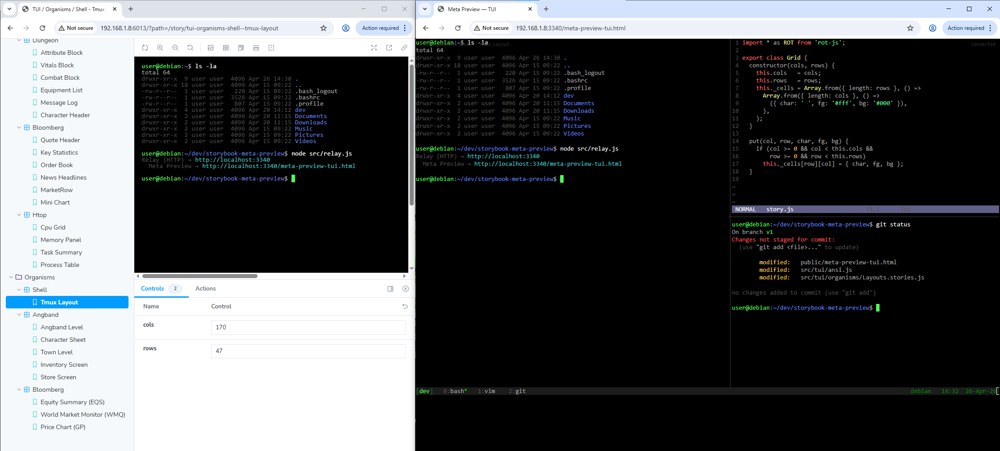

**Angband Level**
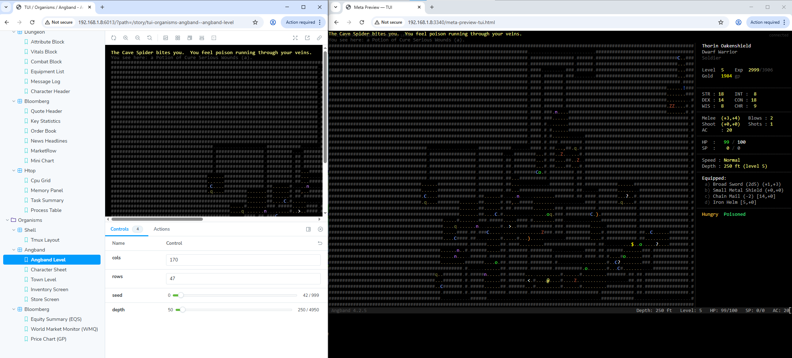

**Angband Character Sheet**
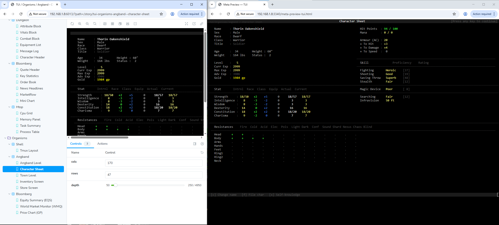

**Angband Town**
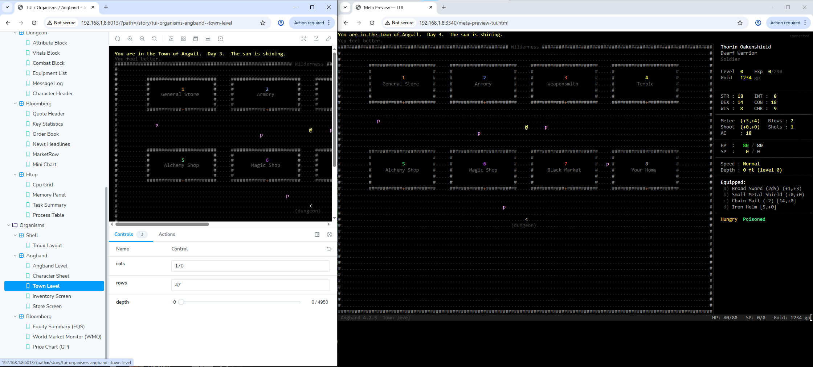

**Bloomberg Equity Summary**


**Bloomberg World Market Monitor**


**Bloomberg Price Chart**


**htop System Monitor**
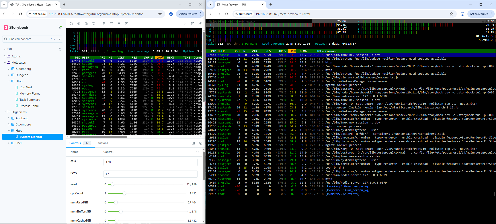

Terminal UI stories. Stories write to a character grid (`Grid` class) using drawing primitives from shared component libraries. The Storybook preview renders via `ROT.Display` (canvas, Terminus font); the meta-preview renders the same grid as ANSI true-colour escape sequences in an xterm.js terminal. Both previews are driven entirely by story args — no auto-resize or layout inference.

| | |
|---|---|
| Storybook | `http://[host]:6013` |
| Meta Preview | `http://[host]:3340/meta-preview-tui.html` |

**Run:**
```bash
yarn dev:tui
```

**Stories:**

*Atoms*
- `TUI / Atoms / Primitives` — Box, Text, ProgressBar, ColorSwatch, Border (170×47 default, Terminus font)
- `TUI / Atoms / Dungeon` — TileReference (terrain/creature/item legend), StatRow, StatusBadge, MessageLine
- `TUI / Atoms / Bloomberg` — PriceTick (price + directional arrow), Sparkline (block-char `▁▂▃▄▅▆▇█`), FunctionKeyBar, SectionLabel
- `TUI / Atoms / Htop` — CpuBar (colored `|` fill by user/kernel/nice/iowait), MemBar, ProcessRow

*Molecules*
- `TUI / Molecules / Dungeon` — AttributeBlock, VitalsBlock, CombatBlock, EquipmentList, MessageLog, CharacterHeader
- `TUI / Molecules / Bloomberg` — QuoteHeader, KeyStatistics, OrderBook, NewsHeadlines, MarketRow, MiniChart
- `TUI / Molecules / Htop` — CpuGrid, MemoryPanel, TaskSummary, ProcessTable

*Organisms*
- `TUI / Organisms / Shell` — TmuxLayout (multi-pane terminal with status bar)
- `TUI / Organisms / Angband` — AngbandLevel (procedural dungeon, seed + depth controls), CharacterSheet, TownLevel, InventoryScreen, StoreScreen
- `TUI / Organisms / Bloomberg` — Equity Summary (EQS: key stats / intraday chart / order book), World Market Monitor (WMQ: Americas, Europe, Asia-Pacific, Commodities, Fixed Income), Price Chart (GP: full-screen ASCII line chart with period selector)
- `TUI / Organisms / Htop` — System Monitor (CPU grid, Mem/Swap bars, task summary, process table; all driven by seed + live controls)

### sdf2d

SDF2D stories define a GLSL `vec3 render(vec2 p)` function using signed-distance field primitives and operations from the shared primitive library. Both the Storybook preview and the meta-preview render the scene as a full-resolution WebGL2 fragment shader — no serialisation of geometry, just the shader source itself.

| | |
|---|---|
| Storybook | `http://[host]:6014` |
| Meta Preview | `http://[host]:3341/meta-preview-sdf2d.html` |

**Run:**
```bash
yarn dev:sdf2d
```

| | |
|---|---|
|  |  |

**Stories:**

*Atoms*
- `SDF2D / Atoms / Shapes` — Circle, Box (plain and rounded), Capsule, Triangle, Pentagon, Hexagon, Octagon, Star, Arc, Pie, Ring, Cross, Heart, Moon, Vesica, Egg — each with `display` control: `field` (IQ distance-field visualization), `fill` (antialiased solid), `outline` (fill with stroke)

*Molecules*
- `SDF2D / Molecules / CSG` — Union, Intersect, Subtract, SmoothUnion, SmoothIntersect, SmoothSubtract — each with separation and shape-size sliders to expose the operation boundary
- `SDF2D / Molecules / Domain` — Flower (polar-repeat petal), Starburst (polar-repeat capsule rays with punched centre), Shells (onion layers via `abs(d) − t`)
- `SDF2D / Molecules / Operations` — Lens, Crescent, SmoothScoop, SmoothIntersect, WireframeTriangle (three capsule edges), RingLattice (grid-repeat ring with punched spot)
- `SDF2D / Molecules / Compositions` — SmoothBlob (four circles smooth-unioned), Dumbbell (capsule bar + end spheres), Wings (mirror + rotate + union), Tile (grid-repeat ring+cross motif), Kaleidoscope (mirror + polar repeat + smooth union + centre punch)

*Organisms*
- `SDF2D / Organisms / Compositions` — Emblem (Wings + Lens as shield boss), TriForce (three WireframeTriangle molecules at equilateral triangle vertices), Cell (SmoothBlob nucleus + RingLattice membrane), GearMandala (Kaleidoscope outer ring + WireframeTriangle centre)
- `SDF2D / Organisms / Fractals` — RoadNetwork (seeded LCG procedural branching roads), KochSnowflake (recursive edge subdivision), Sierpinski (IFS nearest-vertex iteration), SierpinskiCarpet (mod-based centre-third subtraction), DragonCurve (IFS turn-sequence), LevyCCurve (90°-rotated midpoint subdivision), FractalTree (binary branching)

### sdf3d

**Metaballs**
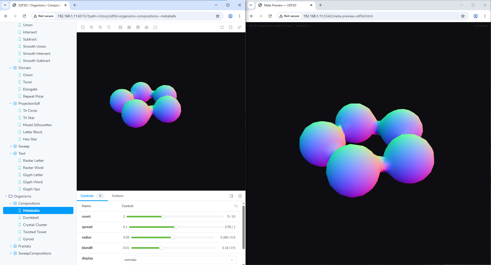

**Letter Block**
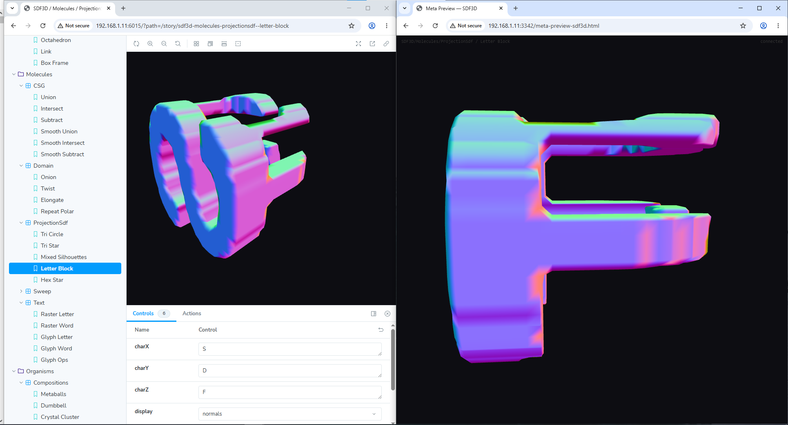

**Sphere (BanterVR)**
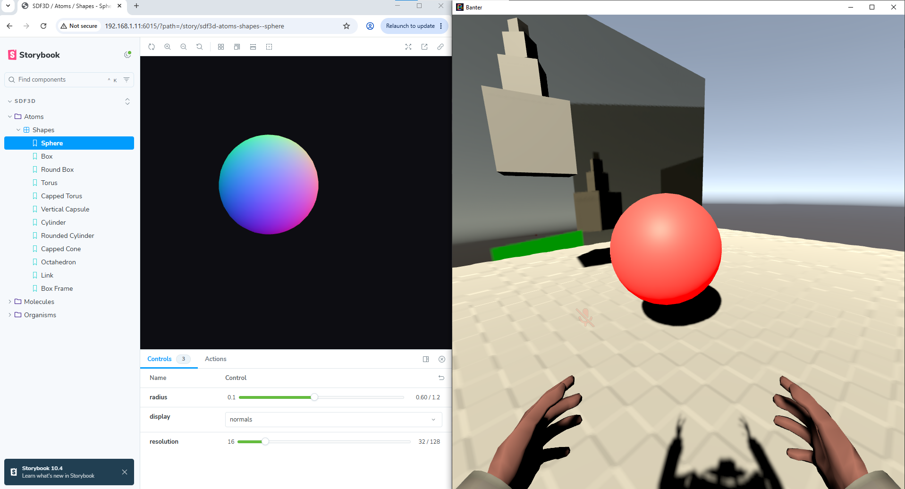

**Metaballs (BanterVR)**
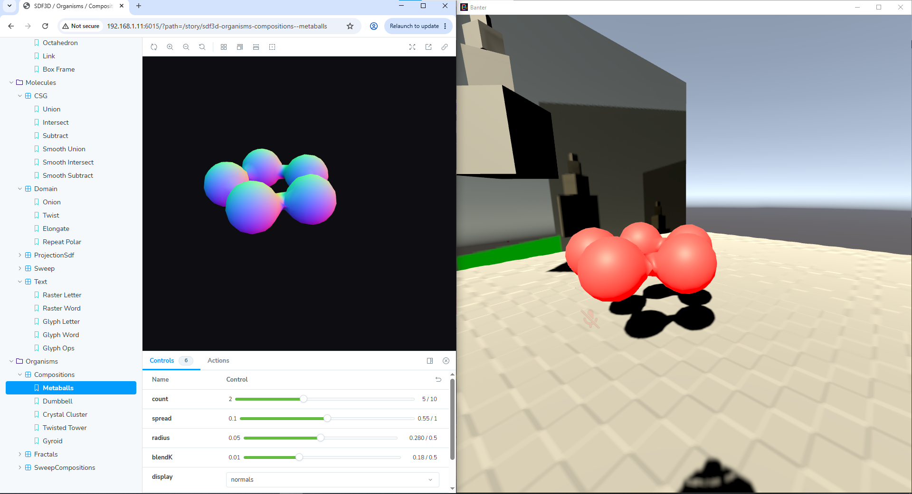

SDF3D stories define JavaScript signed-distance functions — `(THREE.Vector3) => number` — using primitives and operations from the shared functional SDF library. The Storybook preview evaluates the SDF via marching cubes (CPU) to produce a `THREE.BufferGeometry`, then renders it with Three.js and OrbitControls. Normals are computed via central-difference gradient rather than face averaging, giving smooth shading on all SDF surfaces. The meta-preview receives the pre-tessellated geometry over WebSocket and renders it independently with its own OrbitControls.

| | |
|---|---|
| Storybook | `http://[host]:6015` |
| Meta Preview | `http://[host]:3342/meta-preview-sdf3d.html` |
| Inject (HTTPS) | `https://[host]:33420` |

**Run:**
```bash
yarn dev:sdf3d
```

**BanterVR in-world setup:**

The inject script bridges Storybook and your Banter world: selecting any SDF3D story tessellates the SDF on the CPU, sends the resulting mesh to the relay, and the inject script forwards it into Banter — where a Visual Script reads the geometry via the paged marshalling protocol and applies it to a mesh renderer on a game object. The effect is that any SDF shape you browse in Storybook appears as a real 3D mesh in your world in real time, with no Unity editor involvement.

The Visual Script required is the paged geometry marshalling script from the Banter SDK examples (`GeneratedMeshQuatAOTListThreeJS`). Attach it to the game object whose name you use as the `uuid`.

Add the inject script to your Banter world's `index.html`. The `uuid` attribute must match the game object name that owns the Visual Script (defaults to `sdf3d` if omitted):

```html
<script uuid="sdf3d"
        src="https://[host]:33420/meta-preview-bantervr-sdf3d-inject.js"></script>
```

The script connects to the relay, receives marching-cubes geometry whenever a story renders, and exposes the full `BanterThreeJsMarshallingService` paged wire API as `window` globals (`injectVerticesPaged`, `injectNormalsPaged`, `injectIndicesPaged`, etc.) for the Visual Script to call. It then triggers `SendToVisualScripting(uuid + '.updateGeometryPaged', '')` to notify the Visual Script that new geometry is ready.

Each story has a `display` control (`normals` / `solid` / `wireframe`), a `resolution` slider (marching cubes grid size, 16–128), and a `camera` control (`perspective` / `ortho-X` / `ortho-Y` / `ortho-Z`). The orthographic views snap to look straight down each world axis — useful for inspecting projection SDF silhouettes or letter faces head-on.

**Stories:**

*Atoms*
- `SDF3D / Atoms / Shapes` — Sphere, Box, RoundBox, Torus, CappedTorus, VerticalCapsule, Cylinder, RoundedCylinder, CappedCone, Octahedron, Link, BoxFrame

*Molecules*
- `SDF3D / Molecules / CSG` — Union, Intersect, Subtract, SmoothUnion, SmoothIntersect, SmoothSubtract — each with a separation slider to show shapes coming apart or merging
- `SDF3D / Molecules / Domain` — Onion (hollow torus shell), Twist (twist-rate and width controls), Elongate (anisotropic octahedron via per-axis stretch), RepeatPolar (N-fold radial symmetry of capsules around the Y axis)
- `SDF3D / Molecules / Sweep` — 2D SDF profiles swept in 3D: CircleRevolution, StarRevolution, PentagonRevolution, HeartRevolution, EggRevolution (surfaces of revolution); StarExtrusion, HexExtrusion, CrossExtrusion, HeartExtrusion (linear extrusions)
- `SDF3D / Molecules / Text` — RasterLetter, RasterWord (canvas text → Felzenszwalb–Huttenlocher EDT → extruded solid); GlyphLetter, GlyphWord, GlyphOps (exact bezier SDF from Three.js Helvetiker Bold typeface JSON — twist and onion operations remain correct because distances are exact)
- `SDF3D / Molecules / ProjectionSdf` — three canvas silhouettes (one per axis) intersected into a 3D solid: TriCircle (three circles ≈ sphere), TriStar (star on all three axes), MixedSilhouettes (circle × star × cross), LetterBlock (one letter per axis — the sculptor's/CNC technique), HexStar (hex prism with star punched through from above)

*Organisms*
- `SDF3D / Organisms / Compositions` — Metaballs (N spheres on a ring merged by smooth union), Dumbbell (two spheres + capsule stem), CrystalCluster (Fibonacci-lattice octahedra), TwistedTower (twisted pillar + base ring), Gyroid (thickened triply-periodic minimal surface)
- `SDF3D / Organisms / Fractals` — MengerSponge (recursive cross-subtraction, iter 1–3), SierpinskiTetrahedron (IFS fold-scale, iter 1–6)
- `SDF3D / Organisms / SweepCompositions` — SpiralStars (star discs stacked with increasing rotation), HelixCoil (circle profile swept along a helix path), TwinHelix (two intertwined helix strands), KaleidoscoPrism (2D polar-repeated egg profile extruded), StarWreath (star prisms around a revolve ring)

---

## Installation

Requires Node.js 18+ and Yarn classic (1.x).

```bash
yarn install
```

---

## Adding a new setup

1. Add an entry to `setups.js` with the setup name and ports
2. Create `.storybook-[name]/main.js` — copy from `.storybook-html/main.js`, update story paths and port
3. Create `.storybook-[name]/preview.js`:
   ```js
   export { decorators } from '../src/storybook-channel.js';
   ```
4. Create `.storybook-[name]/preview-head.html` — styles for this setup's preview canvas
5. Create `src/[name]/atoms/` and `src/[name]/molecules/`
6. Add scripts to `package.json`:
   ```json
   "storybook:[name]": "STORYBOOK_RELAY_PORT=[relayPort] storybook dev -c .storybook-[name] -p [sbPort] --host 0.0.0.0",
   "relay:[name]":     "PORT=[relayPort] node src/relay.js",
   "dev:[name]":       "concurrently \"yarn relay:[name]\" \"yarn storybook:[name]\""
   ```

---

## Project structure

```
.storybook-[name]/          # Storybook config per setup
  main.js                   # framework, story paths, webpack config
  preview.js                # one-liner re-export from storybook-channel
  preview-head.html         # styles injected into Storybook's preview iframe
src/
  [name]/                   # stories per setup
    atoms/
    molecules/
    organisms/
  relay.js                  # Express + WebSocket relay server (shared)
  storybook-channel.js      # shared decorator — captures renders, sends to relay
  openbrush/
    geometry.js             # edgesFromGeometry() — Three.js geometry → draw.path commands
    utils.js                # command builders: setColor, setSize, path, path3d, line, etc.
    fractals.js             # sierpinskiTriangle, kochSnowflake, dragonCurve, hilbertCurve, barnsleyFern
    story.js                # openbrushStory() helper — canvas preview with oblique projection
    molecules/
      structures.js         # makeTerrain, makeRoadNetwork, makeTree, makeRock, makeScene
  tui/
    story.js                # tuiStory() helper + Grid class (put/fill/text/get)
    ansi.js                 # gridToAnsi() — absolute cursor positioning, true-colour SGR
    dungeonComponents.js    # Angband drawing library: palette C, TILES, atoms, molecules, drawCharacterPanel
    bloombergComponents.js  # Bloomberg drawing library: palette BC, priceHistory(), drawPriceChart(), atoms, molecules
    htopComponents.js       # htop drawing library: palette HC, drawCpuBar(), drawMemBar(), process table, generateProcesses()
    atoms/
    molecules/
    organisms/
  sdf2d/
    primitives.js           # GLSL SDF primitive library (shapes, boolean ops, domain ops, colorize helpers)
    canvas.js               # sdfCanvas() — WebGL2 compile/link/animate helper
    story.js                # sdfStory() — assembles full frag shader, renders in Storybook, packages for relay; col(), displayArgType
    atoms/
    molecules/
    organisms/
  sdf3d/
    marchingcubes.js        # JS port of the classic Paul Bourke marching-cubes algorithm
    isosurface.js           # buildIsosurface() — marching cubes → THREE.BufferGeometry with central-difference normals
    primitives.js           # functional SDF library: primitives (sphere, box, torus, …), boolean ops, domain ops (twist, elongate, revolve, extrude, repeatPolar, …)
    profiles2d.js           # 2D SDF profiles for sweep ops: circle2D, box2D, hexagon2D, pentagon2D, star5_2D, cross2D, heart2D, egg2D
    rasterSdf2d.js          # drawToSdf2D(), textToSdf2D() (canvas → Felzenszwalb–Huttenlocher EDT → 2D SDF), projectionSdf3D() (three-axis silhouette intersection)
    glyphSdf2d.js           # loadThreeFont(), textToGlyphSdf2D() — exact bezier SDF from Three.js typeface JSON; analytic quadratic + Newton cubic; non-zero winding sign
    story.js                # sdf3dStory() — tessellates SDF, renders in Storybook with Three.js + OrbitControls, packages geometry for relay; displayArgType, cameraArgType
    atoms/
    molecules/
    organisms/
public/
  meta-preview.html                  # html setup meta-preview
  meta-preview-threejs-2d.html       # threejs-2d meta-preview
  meta-preview-threejs-3d.html       # threejs-3d meta-preview (with OrbitControls)
  meta-preview-audio.html            # audio meta-preview (Tone.js player)
  meta-preview-openbrush.html        # openbrush meta-preview (HTTP API sender)
  meta-preview-bantervr-ui.html      # bantervr-ui meta-preview
  meta-preview-bantervr-inject.js    # bantervr-ui in-world inject script
  bantervr-ui-test.js                # bantervr-ui standalone demo / known-good reference
  meta-preview-bantervr-inject-3d.js # bantervr-3d in-world inject script
  bantervr-3d-test.js                # bantervr-3d standalone demo / known-good reference
  meta-preview-tui.html              # tui meta-preview (xterm.js terminal, ANSI rendering)
  meta-preview-sdf2d.html            # sdf2d meta-preview (WebGL2 fragment shader renderer)
  meta-preview-sdf3d.html                    # sdf3d meta-preview (Three.js mesh renderer, receives pre-tessellated geometry)
  meta-preview-bantervr-sdf3d-inject.js     # sdf3d in-world inject script — exposes paged geometry wire API as window globals, triggers Visual Script on each story render
setups.js                   # registry of all setups and their ports
```
